# US-Names-1880-2010-project

#### We have here a database broken down into a number of txt files, one for each year from 1880 to 2010. Each of the files contains the name, the sex, and the number of occurrences of the name.

#### National Data on the relative frequency of given names in the population of U.S. births where the individual has a Social Security Number (Tabulated based on Social Security records as of March 6, 2022). For each year of birth YYYY after 1879, we created a comma-delimited file called yobYYYY.txt. Each record in the individual annual files has the format "name,sex,number," where name is 2 to 15 characters, sex is M (male) or F (female) and "number" is the number of occurrences of the name. Each file is sorted first on sex and then on number of occurrences in descending order. When there is a tie on the number of occurrences, names are listed in alphabetical order. This sorting makes it easy to determine a name's rank. The first record for each sex has rank 1, the second record for each sex has rank 2, and so forth. To safeguard privacy, we restrict our list of names to those with at least 5 occurrences.

### Extracting data

#### The first thing we are going to need to do is merge all the files together. Adding a column with the year every data corresponds in every file.

```python
pieces= []
for year in range(1880,2011):
    path= f"babynames/yob{year}.txt"
    frame= pd.read_csv(path, names=["name", "sex", "births"])
    
    #Add a column for the year
    frame["year"]=year
    pieces.append(frame)

#Concatenate everything into a single DataFrame
names=pd.concat(pieces, ignore_index=True)
names
```
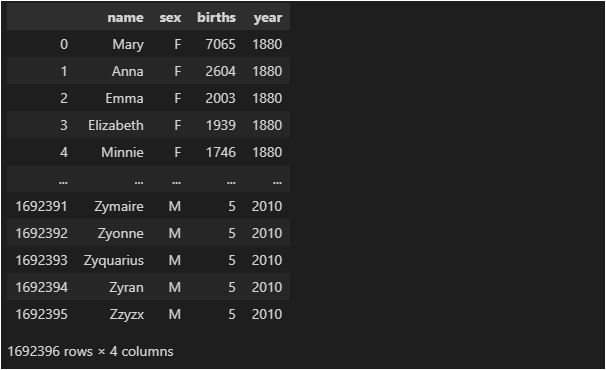

#### Since we have tracked the number of births by year (births= Sum of children with each name), we can show this data by gender.

```python
total_births= names.pivot_table("births", index="year", columns="sex", aggfunc=sum)
total_births.plot(title="Total births by sex and year")
```
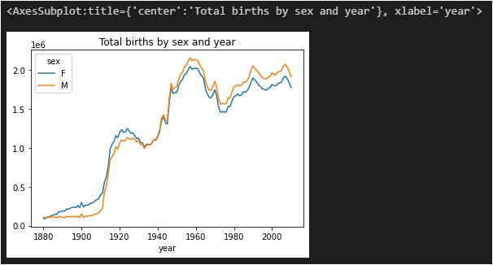

## Female Naming Trends?

### Transforming the data

#### Once we have the number of births by name we can get the proportion of babies given each name relative to the total number of births by year and sex.

```python
def add_prop(group):
    group["prop"]= group["births"]/group["births"].sum()
    return group

names=names.groupby(["year","sex"]).apply(add_prop)
names
```
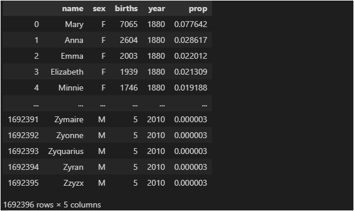

#### With the proportion of every name we can study which are the names used throughout the time by gender. So, we are getting 1000 more chosen names.

```python
def get_top1000(group):
    return group.sort_values("births", ascending=False)[:1000]
grouped= names.groupby(["year", "sex"])
top1000=grouped.apply(get_top1000)

top1000= top1000.reset_index(drop=True)
```

#### Female Naming Trends

```python
girls= top1000[top1000["sex"] == "F"]
```
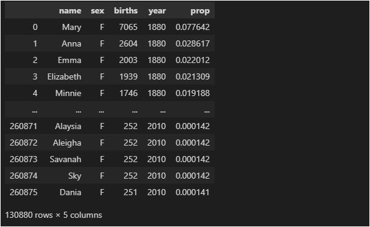

## A few boy and girl names over time

### Transforming the data

#### We can study how many times the proportion of any name has changed throughout time. To know that we need to change the data frame distribution.

```python
total_births= top1000.pivot_table("births", index="year", columns="name", aggfunc=sum)
subset=total_births[["John", "Harry", "Mary", "Marilyn"]]
subset.plot(subplots=True, figsize=(12,10), title="Number of births per year")
```

### Visualizing the data

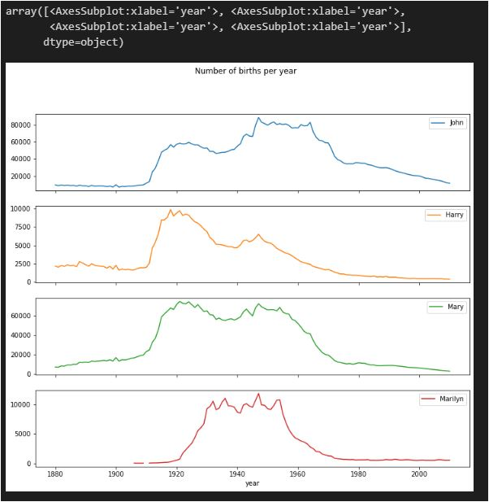

## Proportion of births represented in top one thousand names by sex

### Transforming the data

#### Since we have the names' proportion we can study how much the variety of names have changed. We can do that by getting to know if the sum of the 1000 most chosen names by proportion gets 1.0 (if the total of names is in the 1000 most chosen names).

```python
table= top1000.pivot_table("prop", index="year",columns="sex", aggfunc=sum)
table.plot(title="Sum of table1000.prop by year and sex", yticks=np.linspace(0, 1.2,13))
```
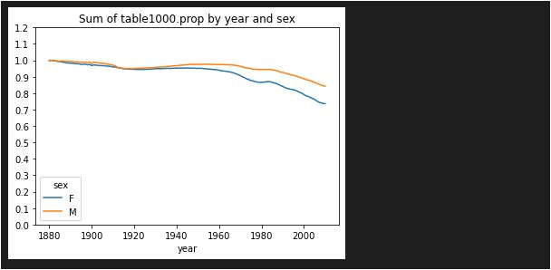

#### We can get to know as well the amount of names that compose the 50% of the names by year and sex.

```python
def get_quantile_count(group, q=0.5):
    group= group.sort_values("prop", ascending=False)
    return group.prop.cumsum().searchsorted(q)+1

diversity=top1000.groupby(["year", "sex"]).apply(get_quantile_count)
diversity=diversity.unstack()
diversity
```
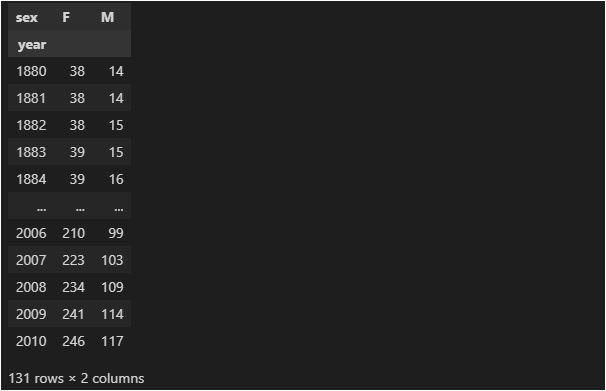

```python
diversity.plot(title="Number of popular names in top 50%")
```
### Visualizing the data
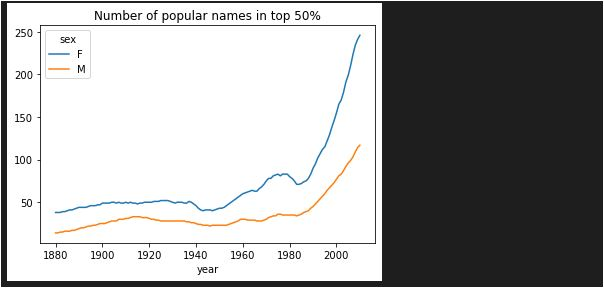

## Last letter changes througout the time

### Transforming the data

#### Amount the things we can study are how has changed throughout time, the amount of time the last letter of every name is chosen, by year, gender, and births. (The proportion of total births for each sex ending in each letter.
#### To do this the first thing we would have to do is to take from every name the last letter, then we would need to add each of these letters to the database and group by sex and year.

```python
def get_last_letter(x):
    return x[-1]

last_letters= names["name"].map(get_last_letter)
last_letters.name="last_letter"

table= names.pivot_table("births", index=last_letters, columns=["sex", "year"], aggfunc=sum)
subtable= table.reindex(columns=[1910,1960,2010], level= "year")
subtable.sum().unstack("year")

letter_prop= subtable/subtable.sum()
letter_prop
```
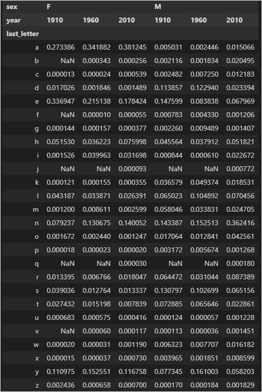

### Visualizing the data

import matplotlib.pyplot as plt

```python
fig,axes=plt.subplots(2,1,figsize=(10,8))
letter_prop["M"].plot(kind="bar", rot=0, ax=axes[0], title="Male", legend=True)
letter_prop["F"].plot(kind="bar", rot=0, ax=axes[1], title="Female", legend=False)
```
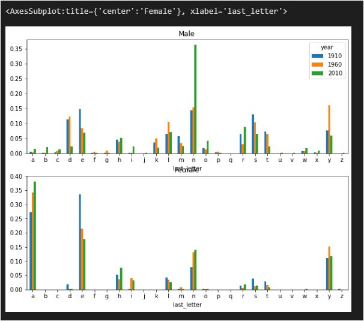

```python
letter_prop=table/table.sum()
dny_ts=letter_prop.loc[["d","n","y"],"M"].T
dny_ts.plot()
```
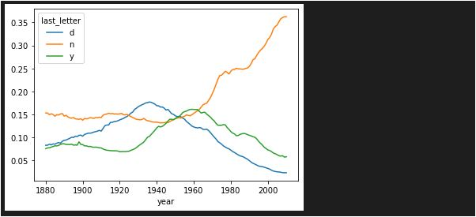

## Name's breakdown by sex over time

### Transforming the data

#### Another interesting thing we can study is if there is a name that started being for women and ended up being for men.

```python
all_names=pd.Series(top1000["name"].unique())
lesley_like= all_names[all_names.str.contains("Lesl")]
filtered=top1000[top1000["name"].isin(lesley_like)]
filtered.groupby("name")["births"].sum()
```
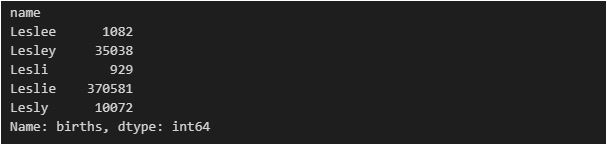

```python
filtered
```
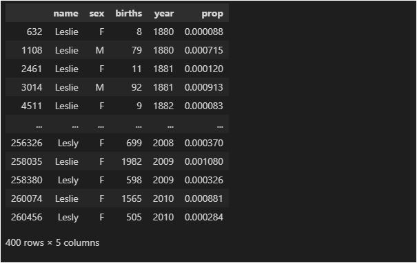

```python
table= filtered.pivot_table("births", index="year", columns="sex", aggfunc="sum")
table=table.div(table.sum(axis="columns"), axis="index")
```

### Visualizing the data

#### Plot of the breakdown by sex over time

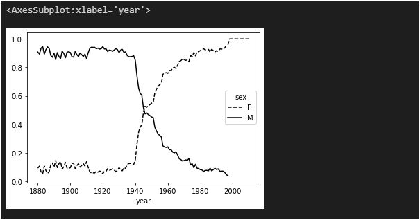


